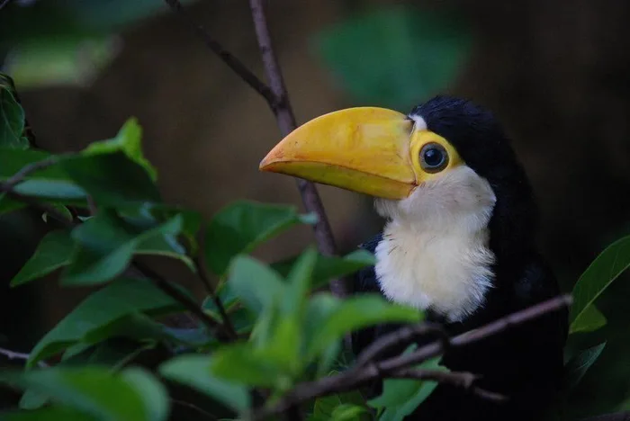

# Docker watchdog - watch the baby tucan!
This repository contains two very similar applications (`src/app1` and `src/app2`) that are packaged into docker images.
They both use [watchdog](https://pypi.org/project/watchdog/) to react to changes in a directory (default: `$HOME/Desktop/test`) 
which is specified as an environment variable to the respective Docker container (see `run_docker_watchdog_*.sh`).

App1
- listens to the creation (aka copying) of images that match the name `*-color.png` in the directory mounted into the 
first Docker container (default: `$HOME/Desktop/test`).
- converts the images to grayscale and saves them as `*-grayscale.png`

App2
- listens to the creation (aka copying) of images that match the name `*-grayscale.png` in the directory mounted into the 
second Docker container (default: `$HOME/Desktop/test`).
- inverts the images' colors and saves them as `*-invert.png`

## Try it out
### Prerequisites
You need to have the following installed:
- Docker
- Python3

### Basics
Clone this repository and `cd` into its root directory.

### Start App1
1. Run `bash build_docker_watchdog_1.sh` to build the Docker image containing App1.
2. Run `bash run_docker_watchdog_1.sh` to run the Docker container.

### Start App2
1. Run `bash build_docker_watchdog_2.sh` to build the Docker image containing App2.
2. Run `bash run_docker_watchdog_2.sh` to run the Docker container.

### Copy images
1. Copy a .png image which matches the naming convention `*-color.png` (e.g. the example picture `images/baby-tucan-color.png`) 
into the mounted directory (default: `$HOME/Desktop/test`).

> Mind that moving the file does not work, only copying!

### Watch ❤ cuteness ❤ happening!

